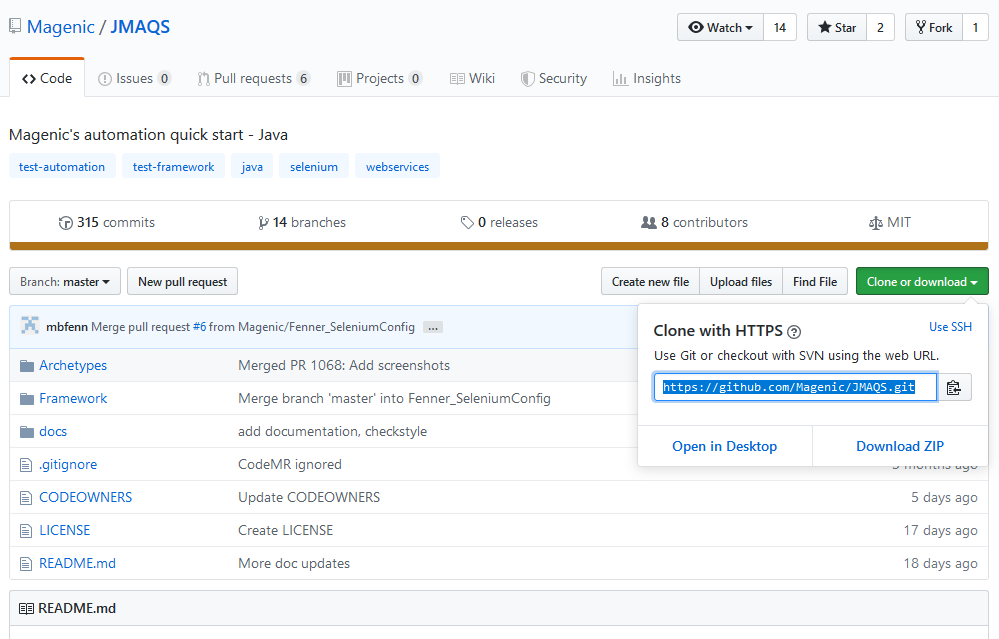
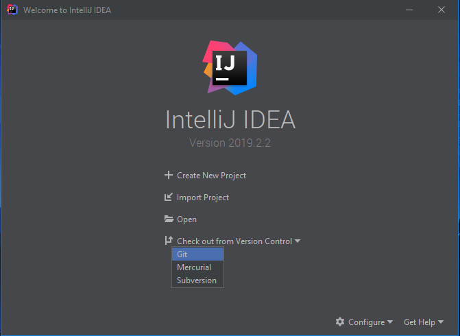
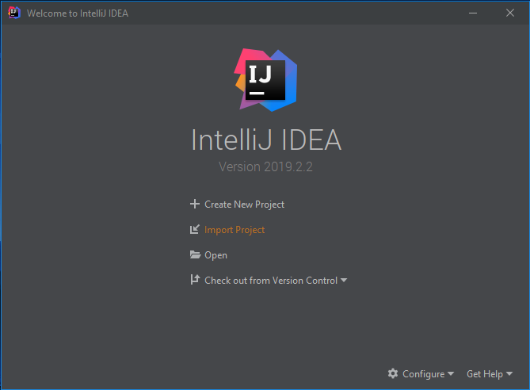
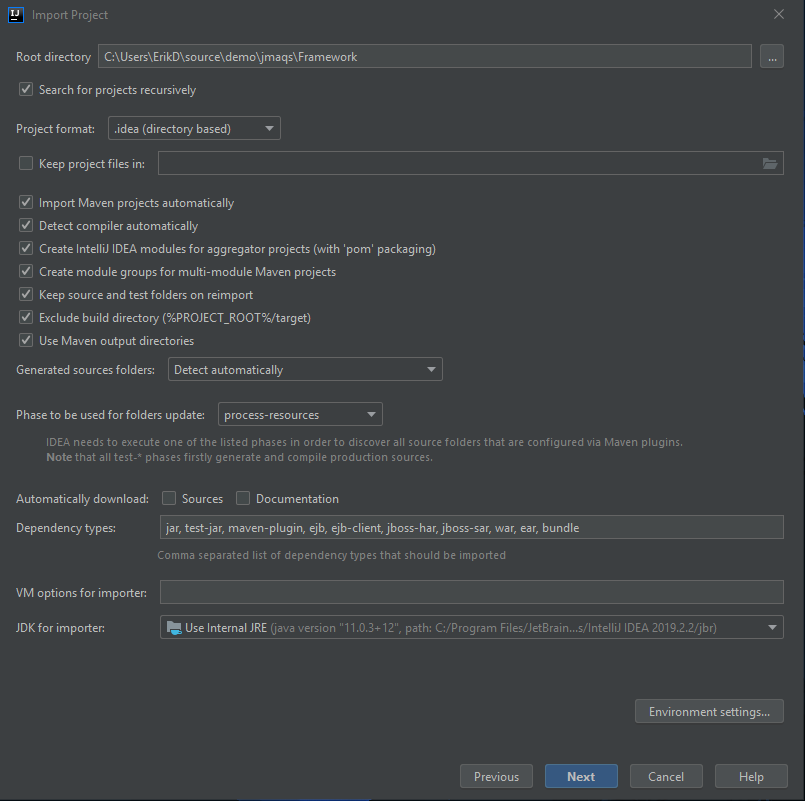
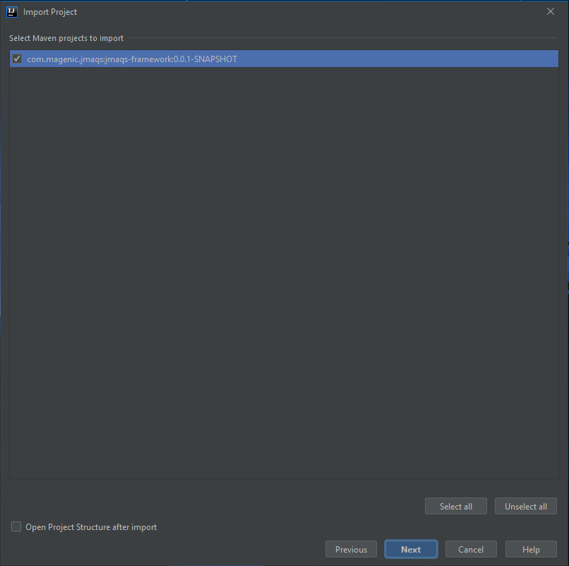
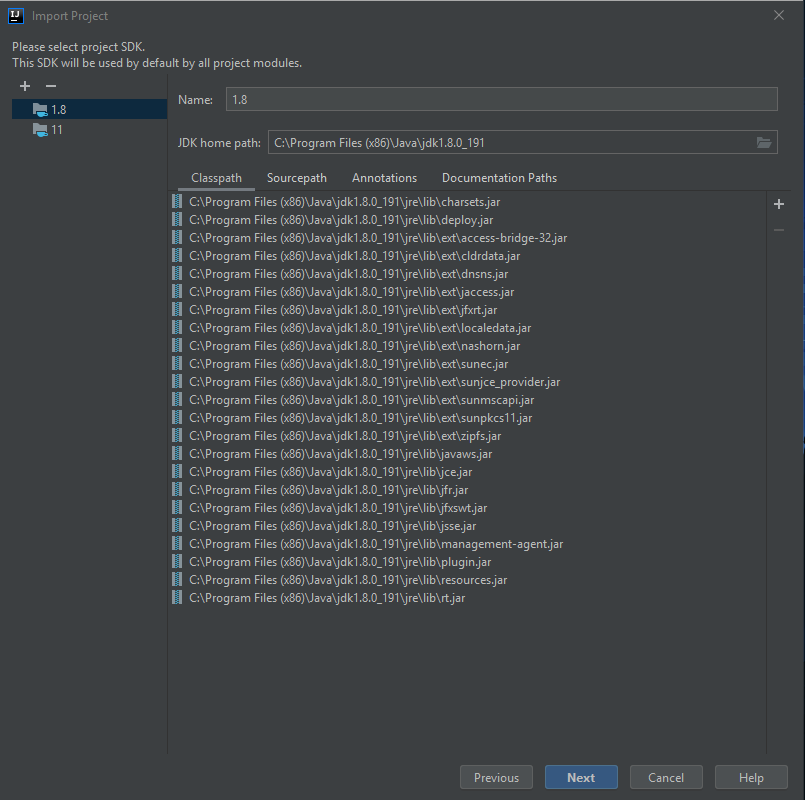

#  JMAQS Contribution Installation Guide

---

## I. Cloning JMAQS Repository

JMAQS – Installation Guide via IntelliJ and GitHub

1. Navigate to [https://github.com/Magenic/JMAQS](https://github.com/Magenic/JMAQS)
2.  Click the **Clone or download button**
3.  Copy the URL - [https://github.com/Magenic/JMAQS.git](https://github.com/Magenic/JMAQS.git)  
    

4. Open IntelliJ (This guide is using version 2019.2.2)  
   Note:  You can download IntelliJ Idea from: [https://www.jetbrains.com/idea/download/#section=windows](https://www.jetbrains.com/idea/download/#section=windows)
5. Click **Check out from Version Control**
6. Select **Git**  
   

7. Paste in the JMAQS Git URL
8. Select a directory for the project
9. Click **Clone**  
   

10. Click  **No**  
    

---  
## II. Settings and Configurations – JMAQS Framework

1. Click **Import Project**  
   

2. Navigate to the project directory and select the **Framework** folder
3. Click **OK**  
   

4. Select **Import project from external model**
5. Select **Maven**
6. Click **Next**  
   

7. Check **Search for projects recursively**
8. Check **Import Maven projects automatically**
9. Check **Create module groups for multi-module Maven projects**
10. Click **Next**  
    

11. Verify **com.magenic.jmaqs:jmaqs-framework** is selected
12. Click **Next**  
    

13. Select the project SDK
14. Click **Next**  
    

15. Verify the project name and file location
16. Click **Finish**  
    

17. When finished loading, the project structure should have Framework at the top-level:  
    

18. Framework expanded:  
    

---   
## III. Code Style Settings - JMAQS Formatter

1.  Navigate to File > **Settings**
2.   Navigate to Editor > **Code Style**
3.   Select the gear icon next to Scheme
4.   Select Import Scheme > **Eclipse XML Profile**  
     

5.   Navigate to the project directory and select **maqs_formatter.xml**
6.   Click **OK**  
     

7.   Click **OK**  
     

8.   A success popup should be displayed
9.    Click **Apply**  
      

####Plugins: CheckStyle-IDEA and SonarLint
1.   Navigate to (File > Settings) **Plugins**
2.   Enter **Checkstyle** into the search bar(Note:Make sure Marketplace tab is selected)
3.   Select **CheckStyle-IDEA**
4.   Click **Install**  
     

5.   If the Third-party Plugins Privacy Note popup is displayed, read the popup and click **Accept**  
     

6.   Restart IDE should be displayed next to CheckStyle-IDEA after installation  
     

7.   Enter **SonarLint** into the search bar
8.   Select **SonarLint**
9.   Click **Install**  
     

10.   **Restart IDE** should be displayed next to SonarLint after installation
11.  Click **OK** or **Restart IDE**  
     

12.  Click **Restart**  
     

13.  When the project has reloaded, navigate to File > **Settings**
14.  Navigate to Other Settings > **Checkstyle**
15.  Set the **Checkstyle version to 7.6.1**
16.  Set the **Scan Scope** to **All sources (including tests)**
17.  Under Configuration File, click the **+** (add) button  
     

18.  Click **Browse** under **Use a local Checkstyle file**
19.  Navigate to the project directory, expand the Framework folder, select **maqs_checks.xml**
20.  Click **OK**  
     

21.  Enter a Description
22.  Check **Store relative to project location**
23.  Click **Next**  
     

24.  Click **Finish**  
     

25.  Check the **Active** box next to the added Configuration File
26.  Click **Apply**
27.  Click **OK**  
      