#  MAQS Contribution Set Up Guide

---

[Github Desktop](#Github Desktop)  
[VS Code](#VS Code)  
[IntelliJ](#IntelliJ)

# Cloning the MAQS Repository

## With Chocolatey
To do this you must first have Chocolatey downloaded.  
To install Chocolatey follow the instructions here: [https://chocolatey.org/install](https://chocolatey.org/install)
 
1. Open Powershell as an administrator level (right click Powershell before opening it)
2. To confirm if Chocolatey is installed, in Powershell enter: **choco -v**   
   It should return a version number (Example: **0.12.0**)
3. Enter this script into powershell and run the script  

```powershell
Set-ExecutionPolicy Bypass -Scope Process -Force; [System.Net.ServicePointManager]::SecurityProtocol = [System.Net.ServicePointManager]::SecurityProtocol -bor 3072; iex ((New-Object System.Net.WebClient).DownloadString('https://chocolatey.org/install.ps1'))
refreshenv
choco install openjdk11 -y
choco install vscode -y
choco install maven -y
choco install gradle -y
refreshenv
code --install-extension redhat.java
code --install-extension vscjava.vscode-maven
code --install-extension vscjava.vscode-gradle
code --install-extension vscjava.vscode-java-pack
```

3. 

---

## Github Desktop
Before going to your IDE, downloading Git Desktop is recommending
Download Git Desktop here: [https://desktop.github.com/](https://desktop.github.com/)

1. Navigate to [https://github.com/CognizantOpenSource/maqs-java](https://github.com/CognizantOpenSource/maqs-java)
2. Click the **Clone** button
3. Click the **Open with GitHub Desktop** button
   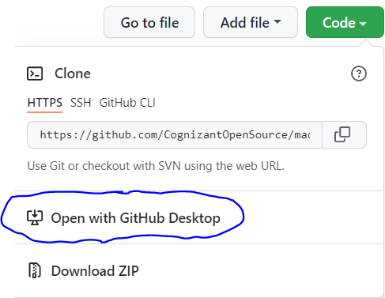
 

4. Select the **Choose...** button to dictate where you want the repo to be   
(or leave it to the default path)
5. Then click the **Clone** button
   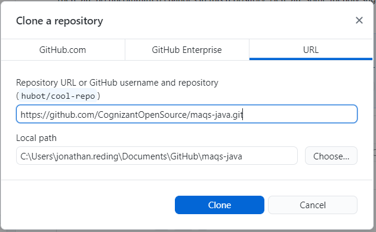


7. Wait for the cloning download to complete
8. The **maqs-java** project should be in the **current repository** drop down
   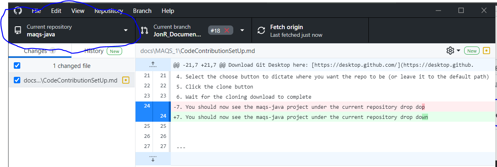

---

## VS Code
Before setting up the project, make sure you have VS Code installed.  
You can install it manually but through Chocolatey is recommended.

### Download VS Code Manually
You can download VS Code here: [https://code.visualstudio.com/Download](https://code.visualstudio.com/Download)

---

## Set up With Chocolatey
To do this you must first have Chocolatey downloaded.  
To install Chocolatey follow the instructions here: [https://chocolatey.org/install](https://chocolatey.org/install)

1. Open Powershell as an **administrator** level  
(right click **Powershell**, left click **Run as Administrator**)
2. To confirm if Chocolatey is installed, in Powershell enter: **choco -v**   
   It should return a version number (Example: **0.12.0**)
3. Enter this script into powershell and run the script

```powershell
Set-ExecutionPolicy Bypass -Scope Process -Force; [System.Net.ServicePointManager]::SecurityProtocol = [System.Net.ServicePointManager]::SecurityProtocol -bor 3072; iex ((New-Object System.Net.WebClient).DownloadString('https://chocolatey.org/install.ps1'))
refreshenv
choco install openjdk11 -y
choco install vscode -y
choco install maven -y
choco install gradle -y
refreshenv
code --install-extension redhat.java
code --install-extension vscjava.vscode-maven
code --install-extension vscjava.vscode-gradle
code --install-extension vscjava.vscode-java-pack
```

3. VS Code should now be installed in your machine

---

#### If MAQS has already been cloned
1. Open VS Code
2. Click Open Folder
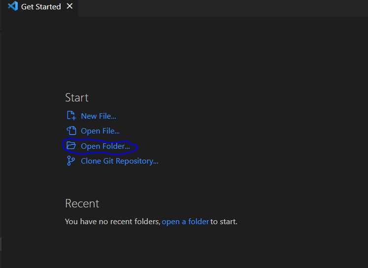


3. Navigate to the MAQS folder
4. Click **Select Folder**
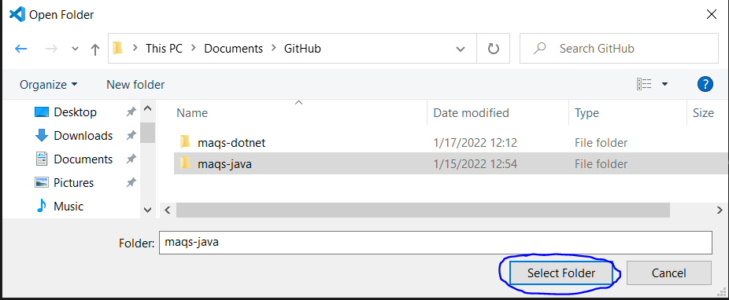


6. The MAQS project should appear in the Explorer section
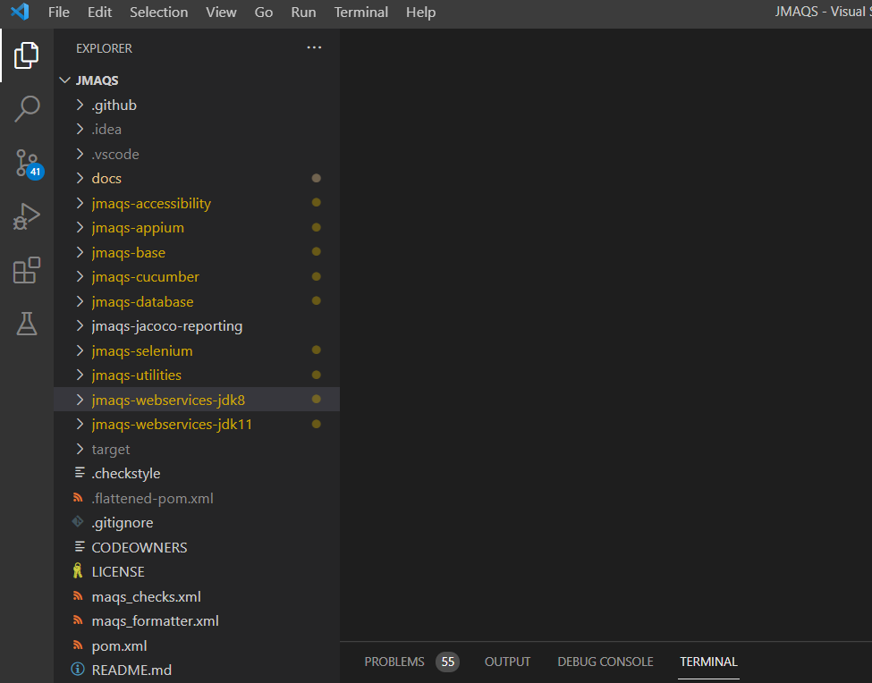

#### If MAQS has not been cloned
1. Open VS Code
2. Click the "Clone Git Repository" button
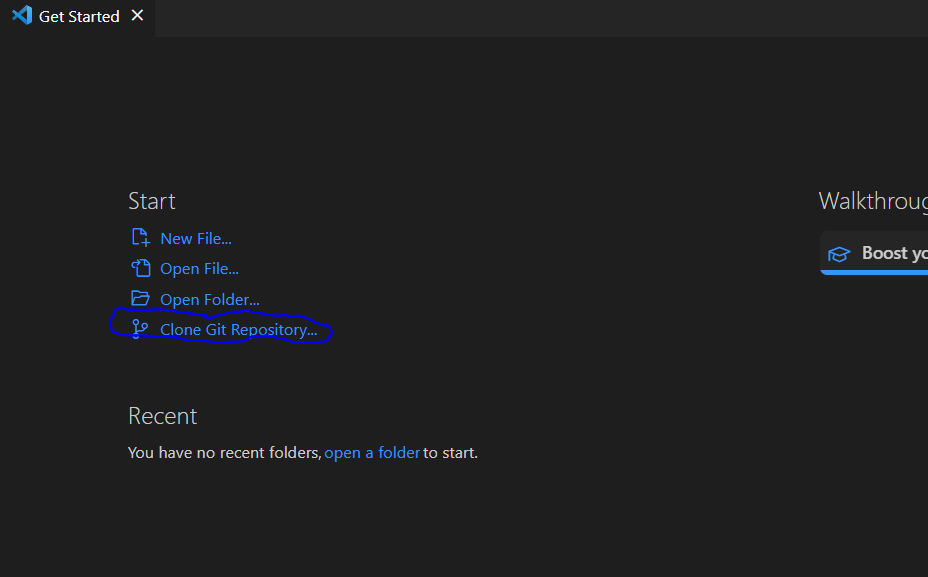


3. Click **Clone from GitHub** in the dropdown
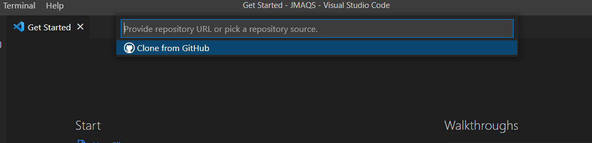


4. Login to your git-hub account  
(if you don't have an account, use the Git Bash instructions)
5. Type in: **CognizantOpenSource/maqs-java** and select it in the dropdown
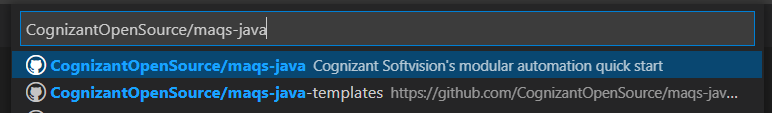


6. Select the location you want the repo to be
7. Select the **Select Repository Location** button
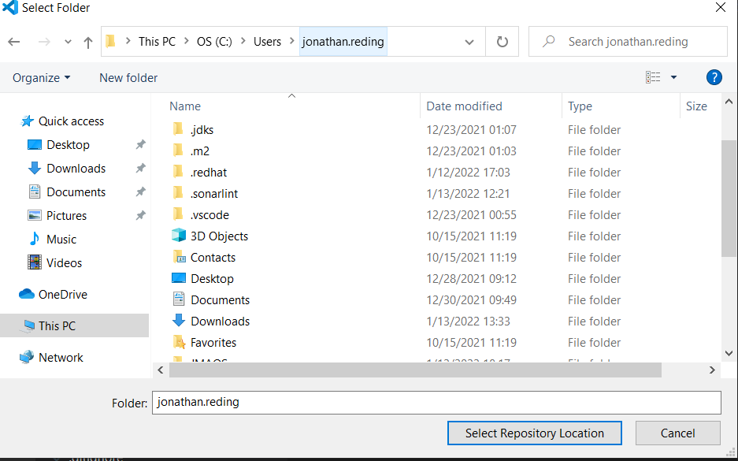


8. Click the **Open in New Window** button
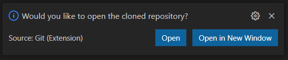


10. You should now be able to open a new window to the MAQS project
 

---

## IntelliJ
Before setting up the project, make sure you have IntelliJ installed  
Note:  You can download IntelliJ Idea here: [https://www.jetbrains.com/idea/download/#section=windows](https://www.jetbrains.com/idea/download/#section=windows)

### If MAQS has been already been cloned
1. Click the **Open** button
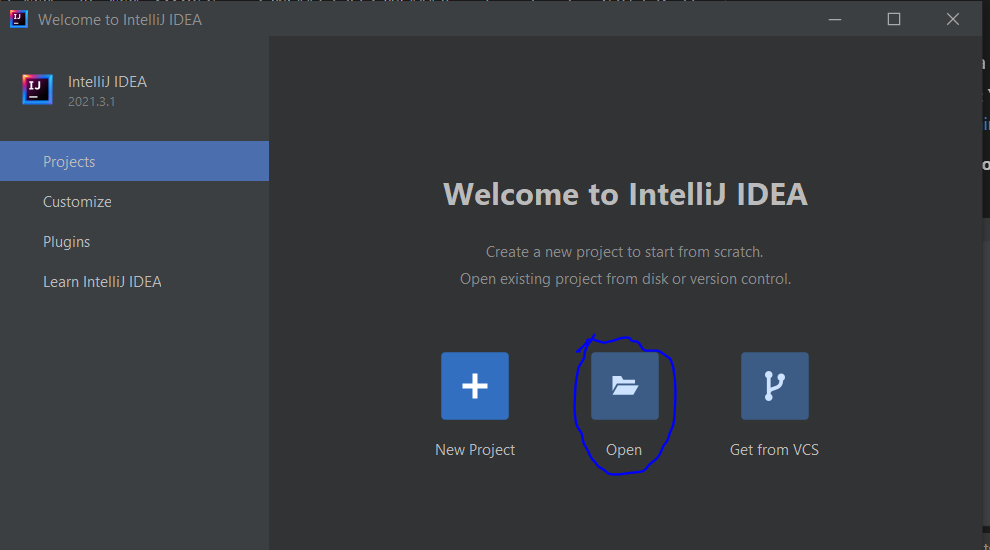


2. Navigate to the **maqs-java** file and select it
3. Click the **OK** button
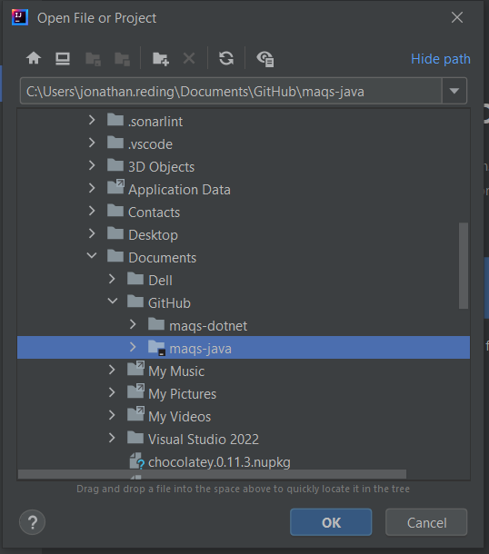


4. The project should show up in the project window (on the left side)
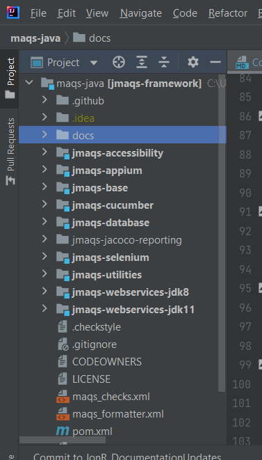

### If MAQS has not been cloned
1. Click the **Get From VCS** button
   


2. Select the **Repository URL** tab
3. For **Version control** select **Git**
4. In the URL text box enter the maqs-java git url:  
   https://github.com/CognizantOpenSource/maqs-java.git
5. Click the **Clone** button
   


6. Select the **Trust Project** button if the prompt appears
7. The project should show up in the project window (on the left side)
   

---  

## IntelliJ: Settings and Configurations

### Setting up the Java JDK
1. Select **File** and click **Project Structure** (default hotkey: ctrl + alt + shift + S)
2. Select the SDK you have locally for the project (JDK 11 or higher is required)
3. Click **Apply** and then click the **OK** button  
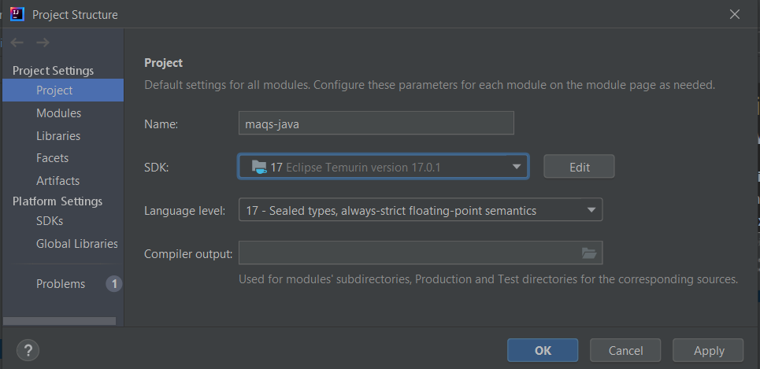


### Plugins: CheckStyle-IDEA and SonarLint
1. Navigate to **File** > **Settings** > **Plugins**
2. Enter **Checkstyle** into the search bar  
(Note: Make sure Marketplace tab is selected)
3. Select **CheckStyle-IDEA**
4. Click **Install**  
     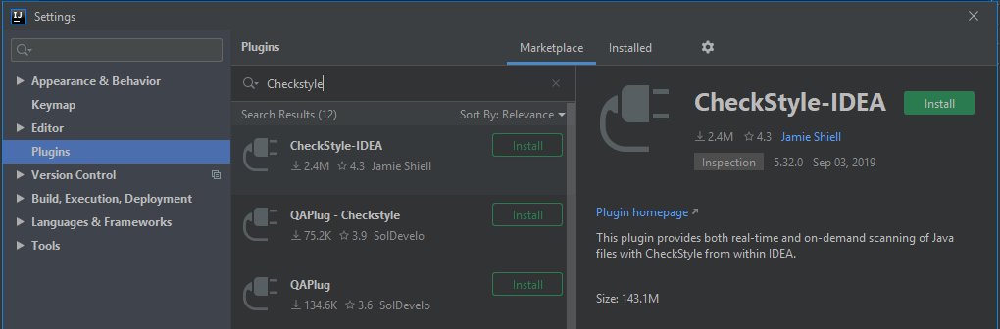


5.   If the Third-party Plugins Privacy Note popup is displayed, read the popup and click **Accept**  
     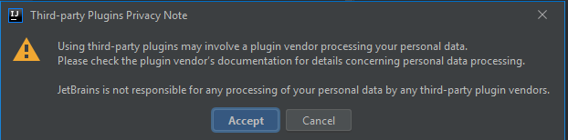


7.   Enter **SonarLint** into the search bar
8.   Click **Install**  
     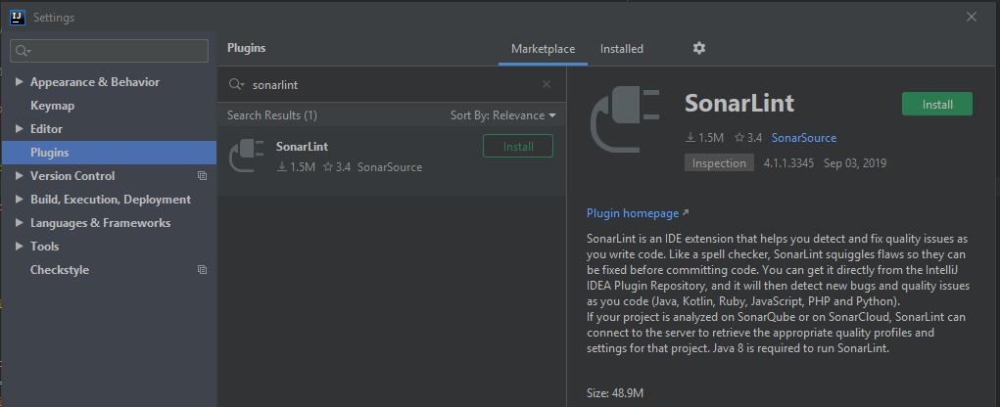


10.  **Restart IDE** should be displayed next to SonarLint after installation
11.  Click **Restart IDE** 
     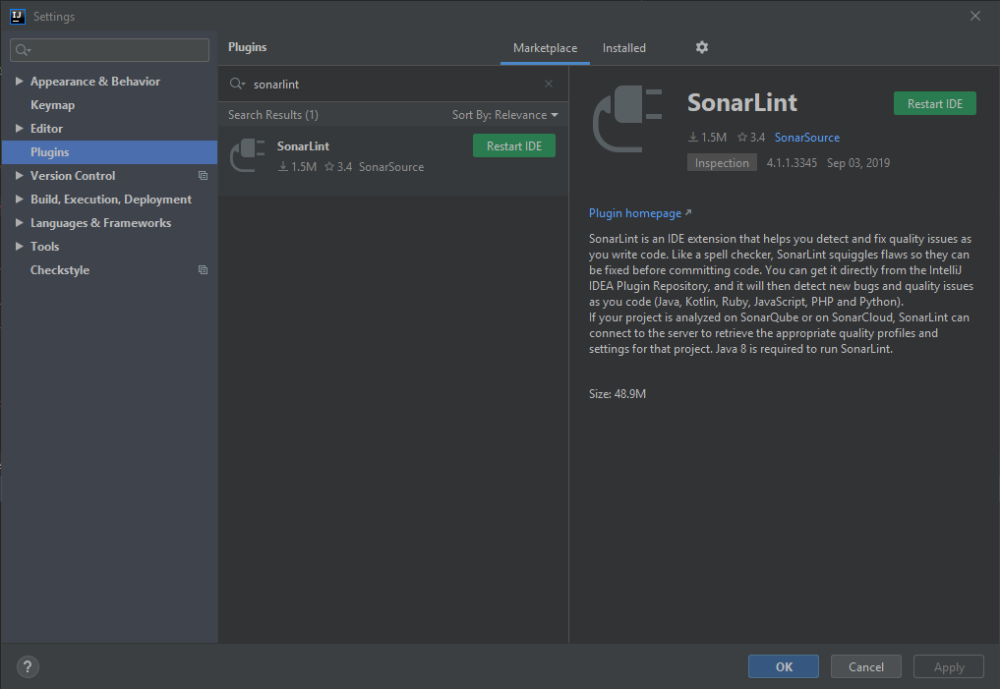


12.  Click **Restart**  
     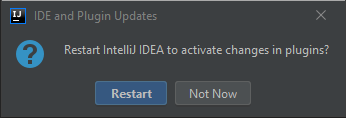


------------
### Set up CheckStyle
1. Navigate to File > **Settings**
2. Navigate to Editor > **Code Style**
3. Select the gear icon next to Scheme
4. Select Import Scheme > **Eclipse XML Profile**  
   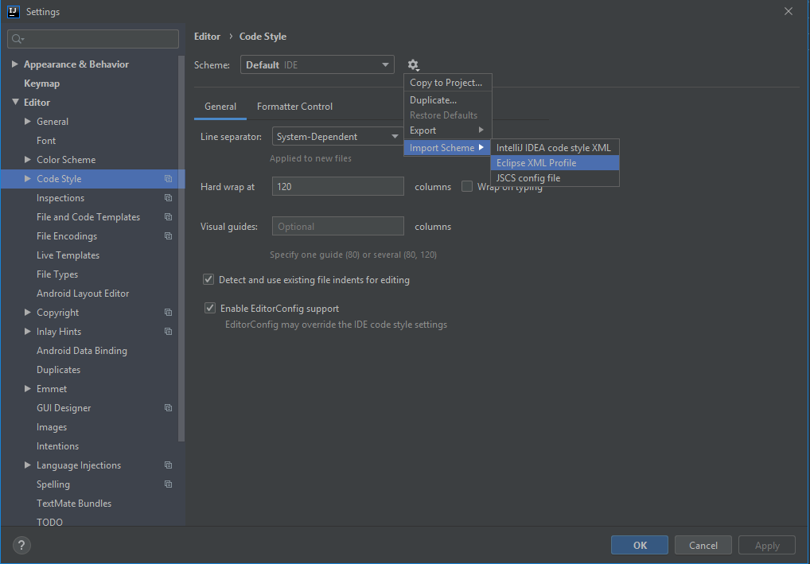


5. Navigate to the project directory and select **maqs_formatter.xml**
6. Click **OK**  
   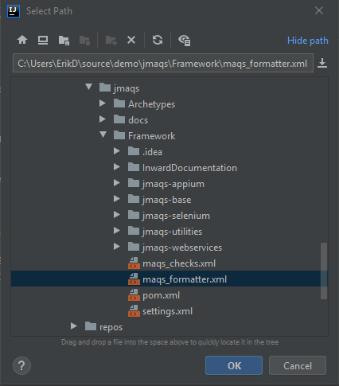


7. Click **OK**  
   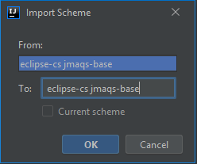


8. A success popup should be displayed
9. Click **Apply**  then click **OK**
   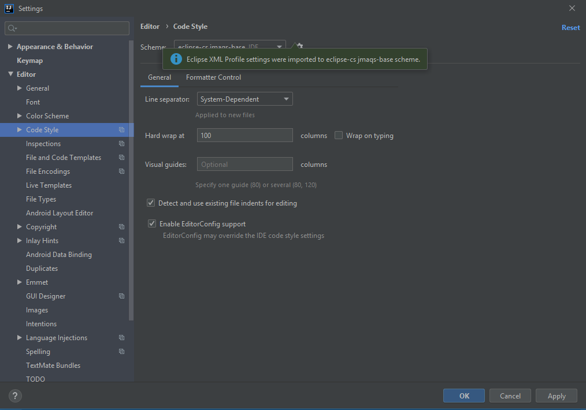

   
10. Next, navigate to **File** > **Settings**
11. Navigate to **Tools** > **Checkstyle**
12. Set the **Checkstyle version** to the latest one
13. Set the **Scan Scope** to **All sources (including tests)**
14. Under Configuration File, click the **+** (add) button  
     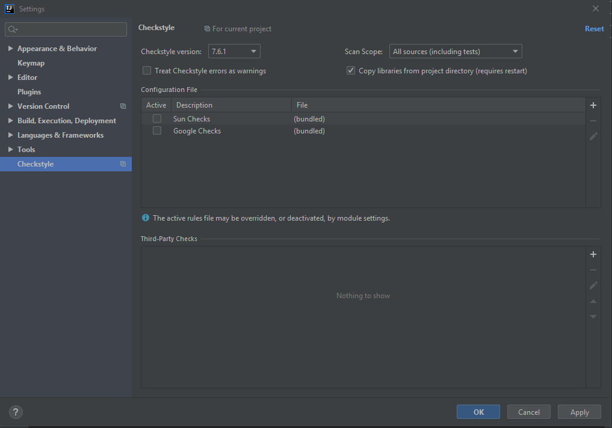


18.  Click **Browse** under **Use a local Checkstyle file**
19.  Navigate to the project directory, expand the Framework folder, select **maqs_checks.xml**
20.  Click **OK**  
     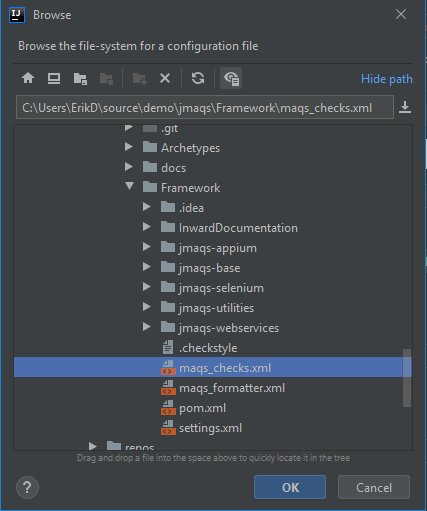


21.  Enter a Description
22.  Check **Store relative to project location**
23.  Click **Next**  
     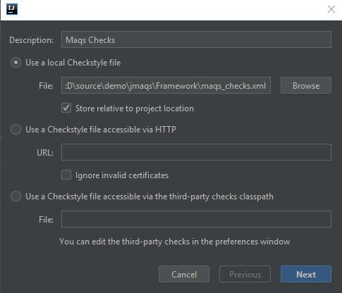


24.  Click **Finish**  
     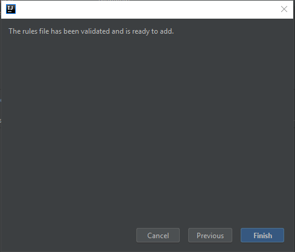


25. Check the **Active** box next to the added Configuration File
26. Click **Apply**
27. Click **OK**  
    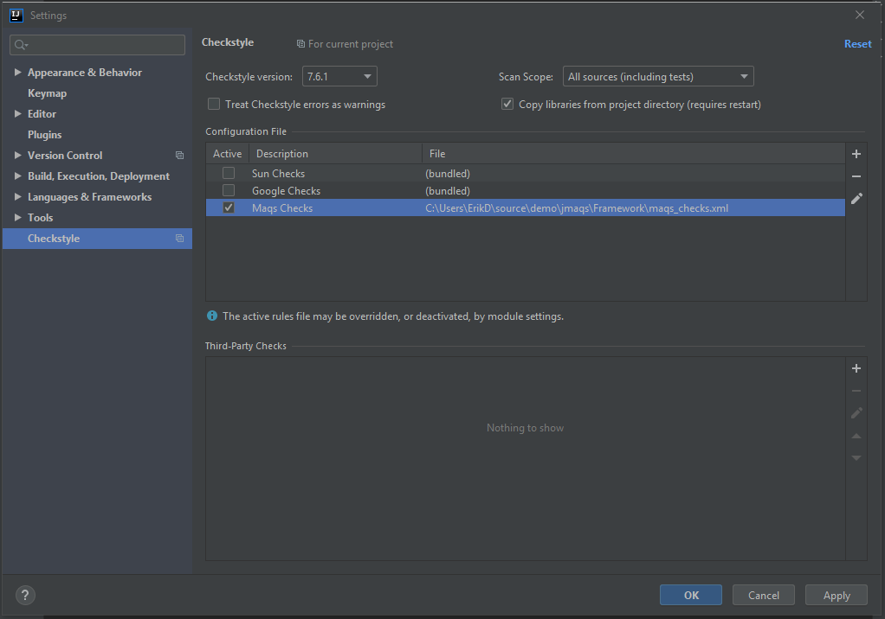


