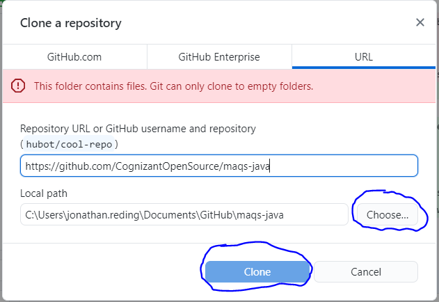
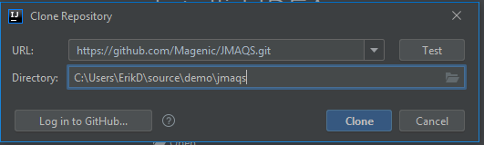
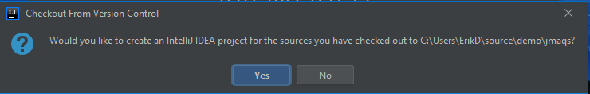
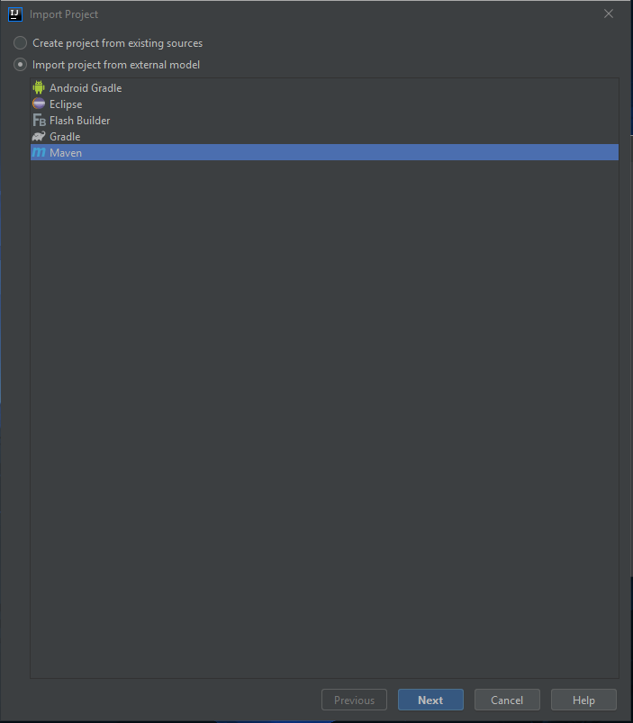
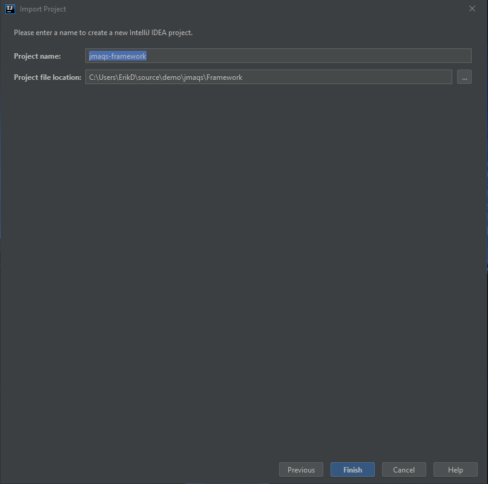
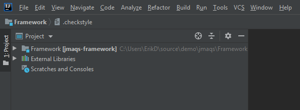
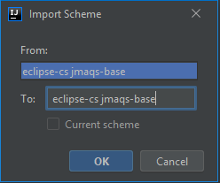
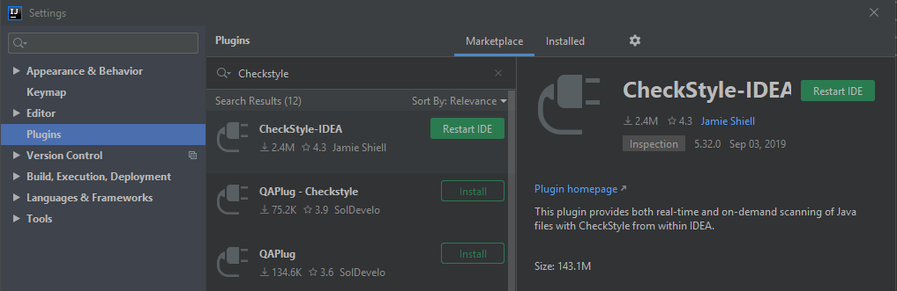

#  MAQS Contribution Set Up Guide

---

[Github Desktop](#Github Desktop)  
[VS Code](#VS Code)  
[IntelliJ](#IntelliJ)

## Cloning the MAQS Repository

---

## Github Desktop
Before going to your IDE, downloading Git Desktop is recommending
Download Git Desktop here: [https://desktop.github.com/](https://desktop.github.com/)

1. Navigate to [https://github.com/CognizantOpenSource/maqs-java](https://github.com/CognizantOpenSource/maqs-java)
2. Click the **Clone** button
3. Click the **Open with GitHub Desktop** button
   
 

4. Select the **Choose...** button to dictate where you want the repo to be (or leave it to the default path)
5. Then click the **Clone** button
   

7. Wait for the cloning download to complete
8. You should now see the **maqs-java** project under the current repository drop down
   

---

## VS Code

### Setting up the MAQS Java Repository
#### If you have cloned via GitHub Desktop
1. Open VS Code
2. Click Open Folder

3. Navigate to the MAQS folder
4. Click **Select Folder**

6. The MAQS project should appear in the Explorer section

#### if the repo has not been cloned
1. Open VS Code
2. Click the "Clone Git Repository" button

3. Click **Clone from GitHub** in the dropdown

4. Login to your git-hub account  
(if you don't have an account, use the Git Bash instructions)
5. Type in: **CognizantOpenSource/maqs-java** and select it in the dropdown

6. Select the location you want the repo to be
7. Select the **Select Repository Location** button

   
8. You should now be able to open a new window to the MAQS project
 

---

## IntelliJ
Before setting up the project, make sure you have IntelliJ installed  
Note:  You can download IntelliJ Idea from: [https://www.jetbrains.com/idea/download/#section=windows](https://www.jetbrains.com/idea/download/#section=windows)

### If you have cloned via GitHub Desktop
1. Click the **Open** button

2. Navigate to the **maqs-java** file and select it
3. Click the **OK** button

4. The project should show up in the project window (on the left side)
   

### if the repo has not been cloned
1. Click the **Get From VCS** button

4. The project should show up in the project window (on the left side)
   

----

2. Paste in the MAQS Git URL
3. Select a directory for the project
4. Click **Clone**  
   

7. Click  **No**  
   

---  
## II. Settings and Configurations – MAQS Framework

1. Click **Import Project**  
   

2. Navigate to the project directory and select the **Framework** folder
3. Click **OK**  
   

4. Select **Import project from external model**
5. Select **Maven**
6. Click **Next**  
   

7. Check **Search for projects recursively**
8. Check **Import Maven projects automatically**
9. Check **Create module groups for multi-module Maven projects**
10. Click **Next**  
    

11. Verify **com.cognizantsoftvision.maqs** is selected
12. Click **Next**  
    

13. Select the project SDK (JDK 11 or higher is required)
14. Click **Next**  
    

15. Verify the project name and file location
16. Click **Finish**  
    

17. When finished loading, the project structure should have Framework at the top-level:  
    

18. Framework expanded:  
    

---   
## III. Code Style Settings - MAQS Java Formatter

#### Set up CheckStyle
1.  Navigate to File > **Settings**
2.   Navigate to Editor > **Code Style**
3.   Select the gear icon next to Scheme
4.   Select Import Scheme > **Eclipse XML Profile**  
     

5.   Navigate to the project directory and select **maqs_formatter.xml**
6.   Click **OK**  
     

7.   Click **OK**  
     

8.   A success popup should be displayed
9.    Click **Apply**  
      

#### Plugins: CheckStyle-IDEA and SonarLint
1.   Navigate to (File > Settings) **Plugins**
2.   Enter **Checkstyle** into the search bar(Note:Make sure Marketplace tab is selected)
3.   Select **CheckStyle-IDEA**
4.   Click **Install**  
     

5.   If the Third-party Plugins Privacy Note popup is displayed, read the popup and click **Accept**  
     

6.   Restart IDE should be displayed next to CheckStyle-IDEA after installation  
     

7.   Enter **SonarLint** into the search bar
8.   Select **SonarLint**
9.   Click **Install**  
     

10.   **Restart IDE** should be displayed next to SonarLint after installation
11.  Click **OK** or **Restart IDE**  
     

12.  Click **Restart**  
     

13.  When the project has reloaded, navigate to File > **Settings**
14.  Navigate to Other Settings > **Checkstyle**
15.  Set the **Checkstyle version** to the latest one
16.  Set the **Scan Scope** to **All sources (including tests)**
17.  Under Configuration File, click the **+** (add) button  
     

18.  Click **Browse** under **Use a local Checkstyle file**
19.  Navigate to the project directory, expand the Framework folder, select **maqs_checks.xml**
20.  Click **OK**  
     

21.  Enter a Description
22.  Check **Store relative to project location**
23.  Click **Next**  
     

24.  Click **Finish**  
     

25. Check the **Active** box next to the added Configuration File
26. Click **Apply**
27. Click **OK**  
     