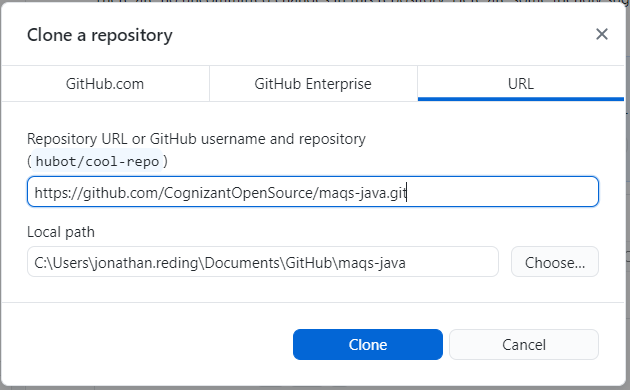
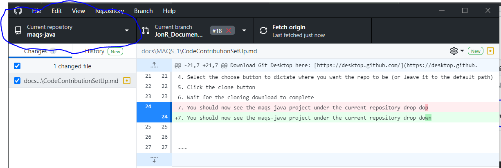

#  MAQS Contribution Set Up Guide

There are multiple ways to set up the project, we recommend using GitHub Desktop  
to clone the repo to your machine.  
If you do not want to use GitHub Desktop there  
are instructions to clone the project through either VS Code or IntelliJ.

---

## IDE Installation Guides

[VS Code](./VS_Code.md) (Recommended)

[IntelliJ](./IntelliJ.md)

---

## Clone MAQS with GitHub Desktop
Before going to your IDE, downloading Git Desktop is recommending
Download Git Desktop here: [https://desktop.github.com/](https://desktop.github.com/)

1. Navigate to [https://github.com/CognizantOpenSource/maqs-java](https://github.com/CognizantOpenSource/maqs-java)
2. Click the **Clone** button
3. Click the **Open with GitHub Desktop** button
   
 

4. Select the **Choose...** button to dictate where you want the repo to be   
(or leave it to the default path)
5. Then click the **Clone** button
   

7. Wait for the cloning download to complete
8. The **maqs-java** project should be in the **current repository** drop down
   
