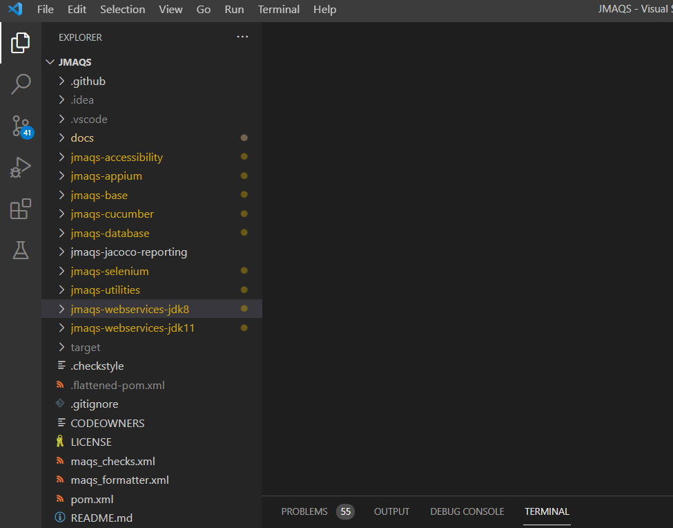
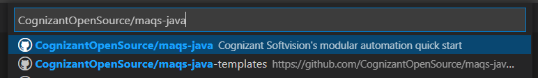
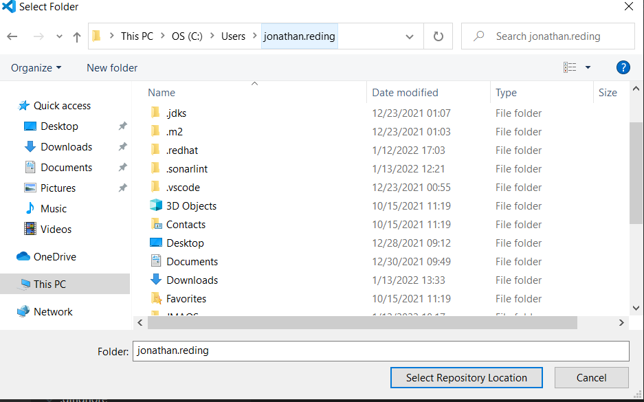
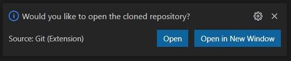

#  VS Code Installation

## VS Code
Before setting up the project, VS Code will have to be installed.  
You can install it manually, but it is recommended to do it through Chocolatey.

---

### Download VS Code Manually
You can download VS Code here: [https://code.visualstudio.com/Download](https://code.visualstudio.com/Download)

---

## Set up With Chocolatey
*Note, this step will install chocolatey on your system.

1. Open Powershell as an **administrator** level  
   (right click **Powershell**, left click **Run as Administrator**)
2. Enter this script into powershell and run the script 

```powershell
Set-ExecutionPolicy Bypass -Scope Process -Force; [System.Net.ServicePointManager]::SecurityProtocol = [System.Net.ServicePointManager]::SecurityProtocol -bor 3072; iex ((New-Object System.Net.WebClient).DownloadString('https://chocolatey.org/install.ps1'))
refreshenv
choco install openjdk11 -y
choco install vscode -y
choco install maven -y
choco install gradle -y
refreshenv
code --install-extension redhat.java
code --install-extension vscjava.vscode-maven
code --install-extension vscjava.vscode-gradle
code --install-extension vscjava.vscode-java-pack
```
* If the JDK fails to install, rerun that command

3. VS Code should now be installed in your machine
4. Open VS code
5. Click the extensions button:  
   


6. In the search box, enter: **Gradle for Java**  
   


7. Below the search box, these Extensions should be installed:  
   **Gradle for Java**  
   **Extension Pack for Java**  
   **Debugger for Java**  
   **Maven for Java**  
   **Test Runner for Java**  
   **Language Support for Java(TM) by Red Hat**
   **Checkstyle for Java**

8. VS Code is now ready, continue to set up the project

---

#### If MAQS has already been cloned
1. Open VS Code
2. Click Open Folder
   


3. Navigate to the MAQS folder
4. Click **Select Folder**
   


6. The MAQS project should appear in the Explorer section
   

#### If MAQS has not been cloned
1. Open VS Code
2. Click the "Clone Git Repository" button
   


3. Click **Clone from GitHub** in the dropdown
   


4. Login to your git-hub account  
   (if you don't have an account, use the Git Bash instructions)
5. Type in: **CognizantOpenSource/maqs-java** and select it in the dropdown
   


6. Select the location you want the repo to be
7. Select the **Select Repository Location** button
   


8. Click the **Open in New Window** button
   


10. You should now be able to open a new window to the MAQS project
    

---

### Post Installation
1. Click the **Testing** button  
   


2. Click one of the **Play** buttons next to a testing module  
   (the **Utilities** test module is recommended)
3. All the tests should pass and no errors should show up in the **Debug Console**  
   
