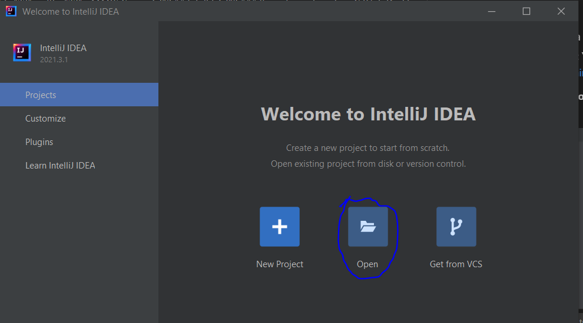
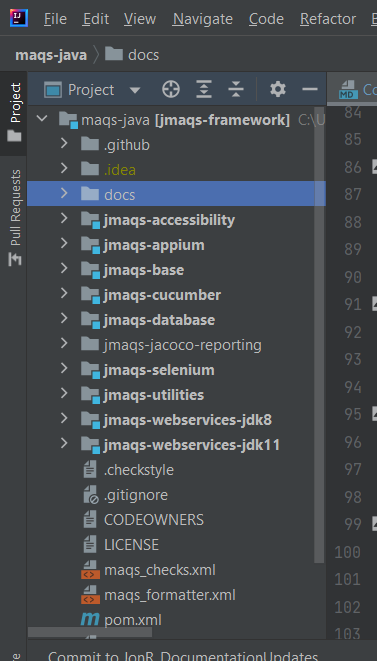
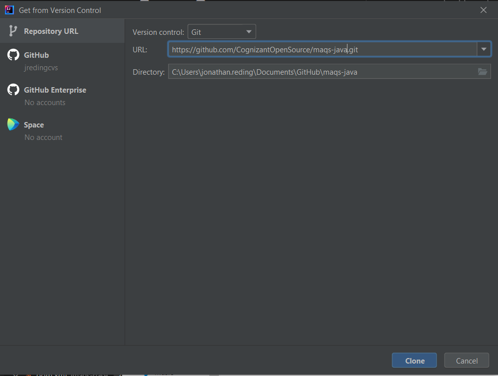
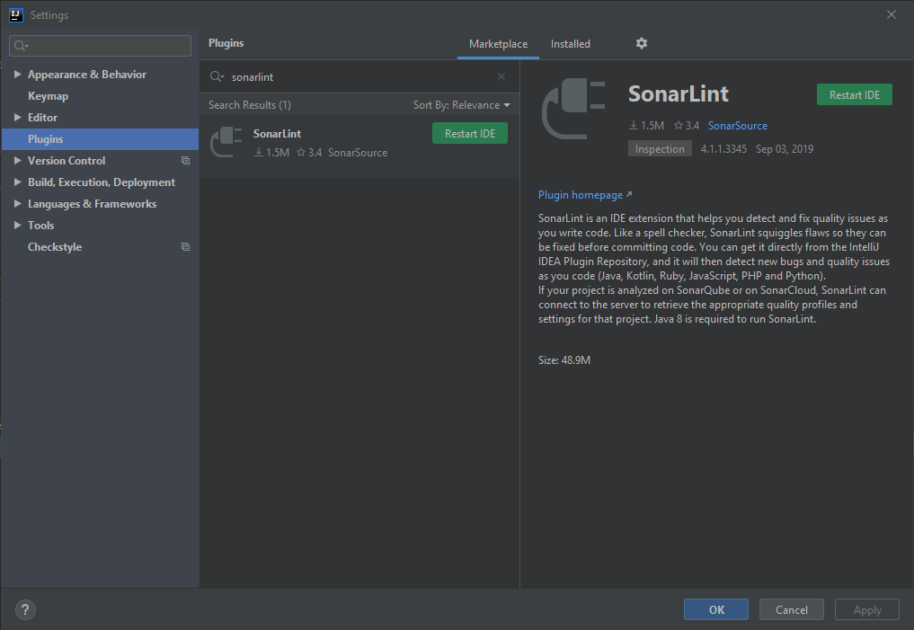
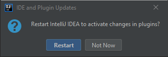
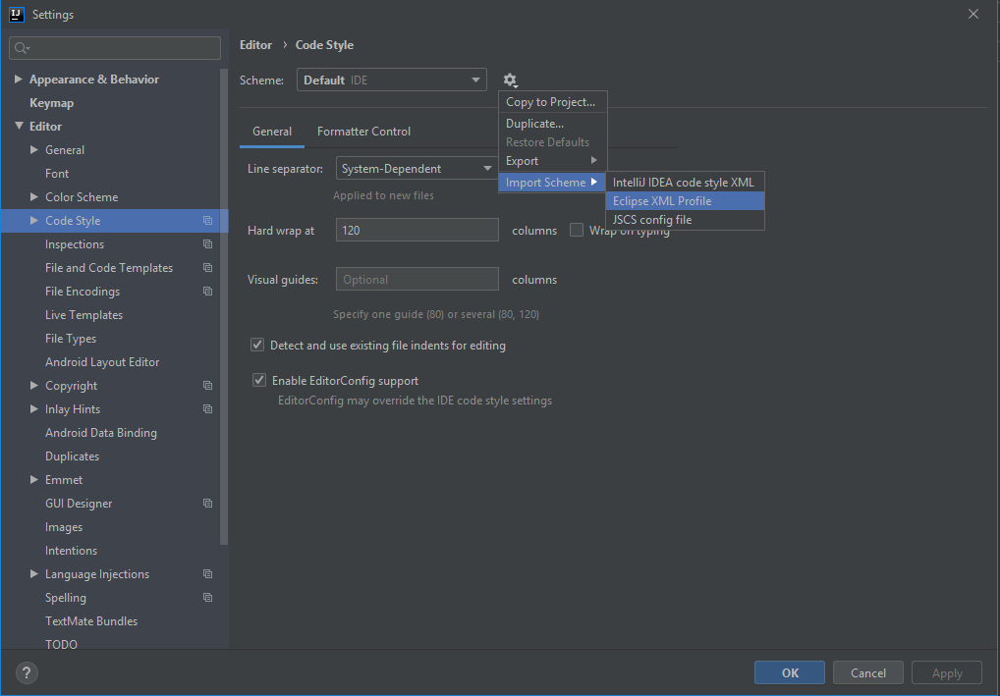
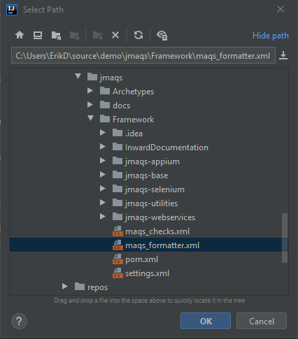
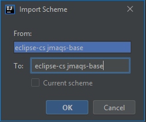
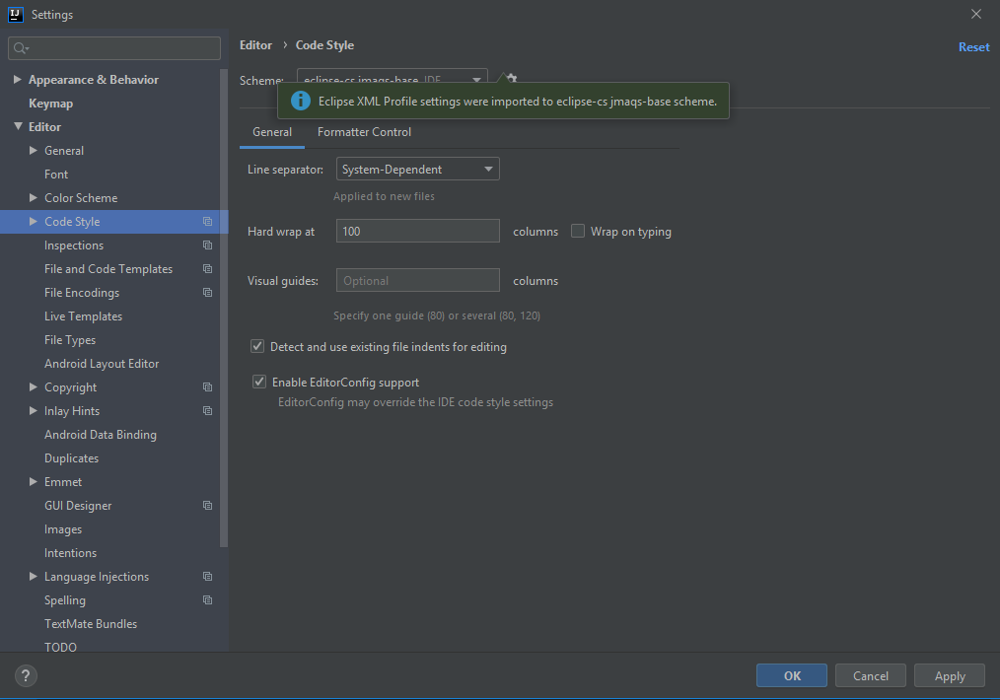
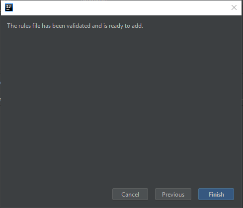

#  VS Code Installation

## IntelliJ
Before setting up the project, make sure you have IntelliJ installed  
Note:  You can download it here: [https://www.jetbrains.com/idea/download/#section=windows](https://www.jetbrains.com/idea/download/#section=windows)

### If MAQS has been already been cloned
1. Click the **Open** button
   

2. Navigate to the **maqs-java** file and select it
3. Click the **OK** button
   

4. The project should show up in the project window (on the left side)
   

### If MAQS has not been cloned
1. Click the **Get From VCS** button
   

2. Select the **Repository URL** tab
3. For **Version control** select **Git**
4. In the URL text box enter the maqs-java git url:  
   https://github.com/CognizantOpenSource/maqs-java.git
5. Click the **Clone** button
   

6. Select the **Trust Project** button if the prompt appears
7. The project should show up in the project window (on the left side)
   

---  

## IntelliJ: Settings and Configurations

### Setting up the Java JDK
1. Select **File** and click **Project Structure** (default hotkey: ctrl + alt + shift + S)
2. Select the SDK you have locally for the project (JDK 11 or higher is required)
3. Click **Apply** and then click the **OK** button  
   

### Plugins: CheckStyle-IDEA and SonarLint
1. Navigate to **File** > **Settings** > **Plugins**
2. Enter **Checkstyle** into the search bar  
   (Note: Make sure Marketplace tab is selected)
3. Select **CheckStyle-IDEA**
4. Click **Install**  
   

5.   If the Third-party Plugins Privacy Note popup is displayed, read the popup and click **Accept**  
     

7.   Enter **SonarLint** into the search bar
8.   Click **Install**  
     

10.  **Restart IDE** should be displayed next to SonarLint after installation
11.  Click **Restart IDE**
     

12.  Click **Restart**  
     

------------
### Set up CheckStyle
1. Navigate to File > **Settings**
2. Navigate to Editor > **Code Style**
3. Select the gear icon next to Scheme
4. Select Import Scheme > **Eclipse XML Profile**  
   

5. Navigate to the project directory and select **maqs_formatter.xml**
6. Click **OK**  
   

7. Click **OK**  
   

8. A success popup should be displayed
9. Click **Apply**  then click **OK**
   

10. Next, navigate to **File** > **Settings**
11. Navigate to **Tools** > **Checkstyle**
12. Set the **Checkstyle version** to the latest one
13. Set the **Scan Scope** to **All sources (including tests)**
14. Under Configuration File, click the **+** (add) button  
    

18.  Click **Browse** under **Use a local Checkstyle file**
19.  Navigate to the project directory, expand the Framework folder, select **maqs_checks.xml**
20.  Click **OK**  
     

21.  Enter a Description
22.  Check **Store relative to project location**
23.  Click **Next**  
     

24.  Click **Finish**  
     

25. Check the **Active** box next to the added Configuration File
26. Click **Apply**
27. Click **OK**  
    